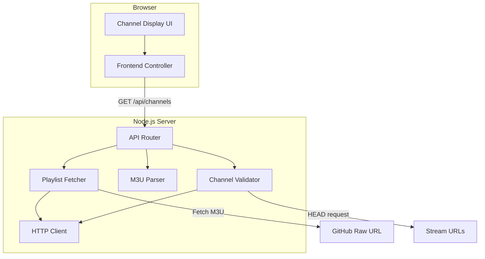

# Design Document

## Overview

The BDIX IPTV Website is a client-side web application that fetches an M3U playlist from a GitHub repository, validates channel availability via a backend proxy, and displays only working channels to the user. The system consists of a lightweight frontend built with HTML, CSS, and vanilla JavaScript, and a minimal Node.js backend that handles playlist fetching and channel validation (to avoid CORS restrictions when probing stream URLs).

### Key Design Decisions

1. **Backend proxy for validation**: Browser-based HTTP requests to arbitrary stream URLs will be blocked by CORS. A Node.js backend performs HEAD requests for channel validation and proxies the playlist fetch.
2. **Vanilla JavaScript frontend**: The feature scope is limited and does not warrant a framework. Vanilla JS with modern DOM APIs keeps the bundle size minimal and removes build toolchain dependencies.
3. **Node.js with Express**: Lightweight, familiar, and sufficient for a simple proxy/validation API.
4. **Concurrent validation with concurrency limit**: The backend validates channels in parallel with a pool of 20 simultaneous requests to balance speed and resource usage.

## Architecture



### Request Flow

1. Browser loads the page and calls `GET /api/channels`
2. Backend fetches M3U playlist from Source_URL (with cache-busting query param)
3. Backend parses M3U content into structured channel data
4. Backend validates each channel concurrently (max 20 simultaneous HEAD requests)
5. Backend returns only working channels as JSON
6. Frontend renders working channels in a responsive grid
7. Frontend sets a timer to poll `GET /api/channels` at the configured interval (default 30 min)

### Auto-Update Flow

1. Frontend timer fires every 30 minutes (configurable)
2. Frontend calls `GET /api/channels` again
3. Backend re-fetches, re-parses, re-validates
4. Frontend compares response to current state; if different, updates the DOM without page reload

## Components and Interfaces

### Backend Components

#### PlaylistFetcher (`src/server/playlistFetcher.js`)

Responsible for retrieving the raw M3U file from the Source_URL.

```typescript
interface PlaylistFetchResult {
  success: boolean;
  content: string | null;
  error: string | null;
}

function fetchPlaylist(sourceUrl: string, timeoutMs?: number): Promise<PlaylistFetchResult>
```

- Appends a unique query parameter (`_t=<timestamp>`) to prevent caching
- Timeout: 15 seconds (configurable)
- Follows redirects (default behavior of HTTP client)

#### M3UParser (`src/server/m3uParser.js`)

Parses raw M3U text into structured channel objects.

```typescript
interface Channel {
  name: string;
  logoUrl: string;
  streamUrl: string;
}

function parseM3U(content: string): Channel[]
```

- Validates `#EXTM3U` header
- Extracts `tvg-logo` attribute from `#EXTINF` lines
- Extracts channel name (text after the last comma on `#EXTINF` line)
- Stream URL is the next non-empty, non-comment line after `#EXTINF`
- Returns empty array and logs warning if format is invalid
- Sets `logoUrl` to empty string if `tvg-logo` attribute is missing
- Skips entries without a valid stream URL line

#### ChannelValidator (`src/server/channelValidator.js`)

Probes channel stream URLs to determine availability.

```typescript
interface ValidationResult {
  channel: Channel;
  isWorking: boolean;
}

function validateChannels(channels: Channel[], options?: ValidationOptions): Promise<Channel[]>

interface ValidationOptions {
  concurrency: number;      // default: 20
  timeoutMs: number;        // default: 10000
  maxRedirects: number;     // default: 5
  onProgress?: (validated: number, total: number) => void;
}
```

- Issues HTTP HEAD requests
- Follows up to 5 redirects
- 10-second timeout per request (including redirect time)
- Classifies 2xx responses as working
- Classifies timeouts, 4xx/5xx, and connection errors as non-working
- Returns only working channels

#### API Router (`src/server/routes.js`)

Express routes exposing the validation pipeline.

```typescript
// GET /api/channels
// Response: { channels: Channel[], total: number, working: number }

// GET /api/channels/stream (SSE for progress updates)
// Events: { type: "progress", validated: number, total: number }
//         { type: "complete", channels: Channel[], total: number, working: number }
//         { type: "error", message: string }
```

### Frontend Components

#### ChannelDisplay (`src/client/channelDisplay.js`)

Renders working channels in a responsive CSS Grid layout.

```typescript
function renderChannels(channels: Channel[]): void
function showLoading(): void
function showProgress(validated: number, total: number): void
function showError(message: string, retryCallback: () => void): void
function showNoChannels(): void
```

#### FrontendController (`src/client/controller.js`)

Orchestrates fetching, progress tracking, and auto-update scheduling.

```typescript
function initialize(): void
function fetchAndDisplay(): Promise<void>
function startAutoUpdate(intervalMs: number): void
function stopAutoUpdate(): void
```

- Connects to SSE endpoint for real-time progress
- Schedules periodic re-fetches
- Compares new channel data to current state before re-rendering

## Data Models

### Channel

| Field     | Type   | Description                                    |
|-----------|--------|------------------------------------------------|
| name      | string | Channel display name (from EXTINF)             |
| logoUrl   | string | URL to channel logo image (from tvg-logo attr) |
| streamUrl | string | Stream URL for playback                        |

### API Response: GET /api/channels/stream (SSE)

```json
// Progress event
{ "type": "progress", "validated": 15, "total": 120 }

// Complete event
{ "type": "complete", "channels": [...], "total": 120, "working": 85 }

// Error event
{ "type": "error", "message": "Failed to fetch playlist" }
```

### Configuration

| Setting          | Default    | Min     | Max      | Description                        |
|------------------|------------|---------|----------|------------------------------------|
| updateInterval   | 30 min     | 5 min   | 24 hours | Polling interval for re-fetch      |
| fetchTimeout     | 15000 ms   | —       | —        | Timeout for playlist fetch         |
| validateTimeout  | 10000 ms   | —       | —        | Timeout per channel validation     |
| maxConcurrency   | 20         | —       | —        | Simultaneous validation requests   |
| maxRedirects     | 5          | —       | —        | Max redirects during validation    |


## Correctness Properties

*A property is a characteristic or behavior that should hold true across all valid executions of a system — essentially, a formal statement about what the system should do. Properties serve as the bridge between human-readable specifications and machine-verifiable correctness guarantees.*

### Property 1: M3U Parsing Round-Trip

*For any* array of valid Channel objects (with non-empty name and stream URL), serializing them to M3U format and then parsing the result back should produce an array of Channel objects with identical name, logoUrl, and streamUrl values.

**Validates: Requirements 2.4**

### Property 2: M3U Format Validation

*For any* string input, the M3U parser produces a non-empty channel list if and only if the input begins with the `#EXTM3U` header and contains at least one `#EXTINF` directive followed by a non-empty stream URL line. Inputs failing this condition always produce an empty array.

**Validates: Requirements 2.2, 2.3**

### Property 3: HTTP Status Classification

*For any* HTTP status code, the channel validator classifies a channel as working if and only if the status code is in the range 200–299. All other status codes (including 4xx and 5xx) result in non-working classification.

**Validates: Requirements 3.2, 3.4**

### Property 4: Channel Name Truncation

*For any* string representing a channel name, the display truncation function returns the original string unchanged when its length is 50 characters or fewer, and returns the first 50 characters followed by an ellipsis (`…`) when the length exceeds 50 characters.

**Validates: Requirements 4.2**

### Property 5: Update Interval Clamping

*For any* numeric value provided as a polling interval, the system clamps it to be no less than 5 minutes and no greater than 24 hours. Values below 5 minutes are set to 5 minutes, values above 24 hours are set to 24 hours, and values within range are preserved unchanged.

**Validates: Requirements 5.1**

### Property 6: Cache-Busting Uniqueness

*For any* base URL and any two distinct invocations of the fetch function, the appended cache-busting query parameter value is unique (never repeats across calls).

**Validates: Requirements 5.4**

### Property 7: Progress Format String

*For any* pair of non-negative integers (validated, total) where validated ≤ total, the progress formatting function produces the string `"{validated} of {total} channels validated"` with the exact numeric values substituted.

**Validates: Requirements 6.2**

## Error Handling

### Playlist Fetch Errors

| Error Condition | Handling | User Feedback |
|----------------|----------|---------------|
| Network unreachable | Catch fetch error, return error result | "Unable to load playlist. Please check your connection." + Retry button |
| DNS resolution failure | Catch fetch error | Same as above |
| HTTP 4xx/5xx from source | Check response status | "Playlist source returned an error. Please try again later." + Retry button |
| Timeout (>15s) | AbortController signal | "Request timed out. Please try again." + Retry button |

### Channel Validation Errors

| Error Condition | Handling | User Feedback |
|----------------|----------|---------------|
| HEAD request timeout (>10s) | AbortController per request | Channel silently marked non-working |
| Connection refused | Catch error | Channel silently marked non-working |
| DNS failure for stream URL | Catch error | Channel silently marked non-working |
| HTTP 4xx/5xx | Check status code | Channel silently marked non-working |

### Display Errors

| Error Condition | Handling | User Feedback |
|----------------|----------|---------------|
| Logo image fails to load | `onerror` handler on `` | Placeholder image shown with channel name |
| Zero working channels | Check array length | "No working channels found at this time." message |
| SSE connection lost | EventSource `onerror` | Fallback to polling, show subtle reconnection indicator |

### Auto-Update Errors

| Error Condition | Handling | User Feedback |
|----------------|----------|---------------|
| Periodic re-fetch fails | Retain current channel list | No visible error (silent retry at next interval) |
| Re-validation fails | Retain current channel list | No visible error (silent retry at next interval) |

## Testing Strategy

### Unit Tests

Unit tests cover specific examples, edge cases, and component interactions:

- **M3U Parser**: Parse valid M3U content with known entries, verify exact field extraction. Test edge cases: missing tvg-logo, entries without stream URLs, empty content, non-M3U content, content with only header.
- **Channel Validator**: Mock HTTP responses for specific status codes (200, 301→200, 404, 500, timeout). Verify classification results.
- **Name Truncation**: Test specific strings at boundary lengths (49, 50, 51 characters).
- **Interval Clamping**: Test specific values at boundaries (4 min, 5 min, 24 hours, 25 hours).
- **Frontend Controller**: Mock SSE events and verify DOM state transitions (loading → progress → complete).
- **Error Handling**: Test each error condition from the error table above.

### Property-Based Tests

Property-based tests verify universal properties across generated inputs using **fast-check** (JavaScript PBT library):

- **Configuration**: Minimum 100 iterations per property
- **Tag format**: Feature: bdix-iptv-website, Property {N}: {property_text}

| Property | Test Description | Generator Strategy |
|----------|-----------------|-------------------|
| Property 1 | Round-trip: serialize → parse channels | Generate arrays of Channel objects with random names (1-100 chars), random valid URLs, random logo URLs (including empty) |
| Property 2 | Format validation | Generate random strings (both valid M3U and arbitrary content), verify parser output matches predicate |
| Property 3 | Status classification | Generate random integers 100-599, verify classification matches 200-299 range check |
| Property 4 | Name truncation | Generate random strings 0-200 chars, verify truncation rule |
| Property 5 | Interval clamping | Generate random numbers (including negatives, zero, very large), verify clamping bounds |
| Property 6 | Cache-busting uniqueness | Generate random base URLs, call function twice, verify parameter values differ |
| Property 7 | Progress format | Generate random (validated, total) pairs where 0 ≤ validated ≤ total, verify string format |

### Integration Tests

- End-to-end flow: fetch → parse → validate → display with a mock HTTP server
- Auto-update cycle: verify re-fetch detects changes and updates DOM
- Concurrent validation: verify max 20 simultaneous requests
- SSE progress streaming: verify real-time progress events

### Test Tools

- **Test runner**: Vitest
- **PBT library**: fast-check
- **HTTP mocking**: msw (Mock Service Worker) for backend integration tests
- **DOM testing**: jsdom (via Vitest environment)
